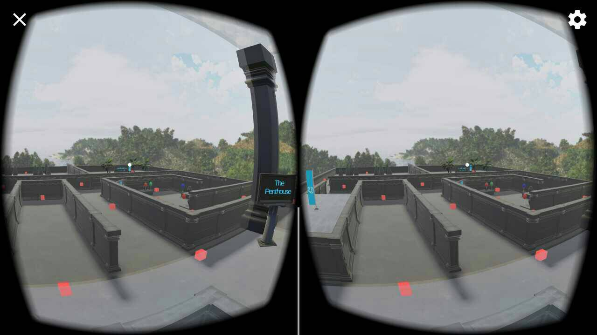

# udnd_03_maze
udnd Maze for project 3 in Udacity VR course - September 2017

### Customizations
TBD

* TBD

### Comments
TBD

* Challenges
  * Reticle interactions - generally the click-based navigation with waypoints was
    a very unsatisfying experience, both as a user and a developer.  Primarly,
    the default max-distance for the reticle (20m) made it hard
    to reliably interact with the waypoints in a space this large.  During mid development
    some 49 waypoints were created and it still wasn't enough for the colliders to be in range.
  * Incorrect reticle configuration - the default prefab in GVR 1.7.0 was configured as
    ``direct`` when [subsequent documentation and a bug](https://github.com/googlevr/gvr-unity-sdk/issues/666#issuecomment-322941244)
    found that it should instead be ``camera``.  I assume this causes some speed and
    quality issues but it was changed.
  * Rotation troubles - When creating some objects and using prefabs, I found that
    instantiating a new object using parent, global, or local rotation was slightly confusing.
  * Overlapping walls and objects - similar to the positioning of game objects to be
    flush with other walls, floors, etc, I found some challenge in reducing the visual
    "glitches" caused by two surfaces trying to simultaneously render (e.g. a column and a wall)
* Positive findings
  * Camera textures - it was fun to discover the capability for a camera texture and
    an easy implementation of it in the game.
  * Creating new materials - semi-transparent and movie-playing textures were fairly trivial
    to create as ell.
  * Linked audio and animation - in animation controller for treasure chest, establish audio and visual link as well as time-delayed open/close action
* Time concerns
  * Initial setup and alignment of the maze walls - this took longer than expected with
    no automated tools and positioning being fairly arbitrary (e.g. no easy grid snap)
  * More message board interaction - additional interactions could be added to the
    various sign/display boards, but the gameplay was simplified to be more intuitive
    instead of thinking of all of these shortfalls.

## Project Contents
Quick description of contents within this repo.

* Assets - assets including GoogleVR SDK clips for project
* ProjectSettings - project settings for builds
* .gitignore - ignore file based on Unity footprint
* build.zip - compressed build for Android
* LICENSE - current license
* README.md - this file
* screens/ - examples of screenshots within app

## Requirements
Software and build environment requirements.

* [Unity 2017.1.0p4](https://unity3d.com/get-unity/download/archive)
* [GVR Unity SDK v1.70.0](https://github.com/googlevr/gvr-unity-sdk/releases/tag/v1.70.0)
* Course starter materials
* Android KitKat 4.4 or later

### Extra Assets
A few extra assets were used in the creation of this project.  A best effort attempty includes the original source for this content and associated *free* AssetStore Assets (placed in the [MarketExtra](Assets/MarketExtra) folder).

* [Aquarium and Fish Video](https://www.youtube.com/watch?v=bdnHKdb-Oss) - parts used for video puzzle
* [FruitPack](https://www.assetstore.unity3d.com/en/#!/content/80254) - bananas!
* [Odds N Ends Series Vol. 1](https://www.assetstore.unity3d.com/en/#!/content/60504) - banana trees
* [various sound effects](https://www.partnersinrhyme.com/soundfx), [various sound effects 2](http://freesound.org) - shock, door, treasure, knock

### Spoilers

Read no further unless you want to see solutions for the "maze" in this game!

1. The player must collect three coins and throw them into the fountain to make a key appear.
   * A sign near the fountain tells the player "three wishes in this well are the key to success"
1. One coin can be found by watching a fish video and answering questions.
   * A sign indicates "a sharp eye is often paid quite well"
1. One coin can be found by spelling out the word "Bananas" next to the banana tree.
   * A sign indicates that "spell out the obvious for a pay off (click to reset)"
   * In this area, the user must gaze at the right letter in order.
1. One coin can be found by releasing all but the blue balloons.
   * A sign indicates that "wishful thinking is never blue"
   * Here, the user releases one of many balloons by starting at them.
1. A view from the "penthouse" will let a player get a quick cheat sheet if they look
   at the roof of the main temple building.
