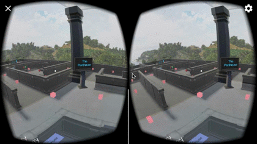

# udnd_03_maze
udnd Maze for project 3 in Udacity VR course - September 2017

## Project Contents
Quick description of contents within this repo.

* Assets - assets including GoogleVR SDK clips for project
* ProjectSettings - project settings for builds
* .gitignore - ignore file based on Unity footprint
* build.zip - compressed build for Android
* LICENSE - current license
* README.md - this file
* Walkthrough/ - examples of screenshots and solutions to puzzles

### Customizations
The project prompt was a simple maze, but this application incorporates a few
simple puzzles to provide pick-up items.  In addition to these puzzles, a number
of other object configurations inspired by the material in this course were
created to learn and flex the engine a little.

* Waypoint navigation - for a while, waypoint navigation seemed non-ideal. After
exploring some alternatives like a lean-in or mode-based auto navigation, the
existing waypoint click method was re-adopted.  
* Penthouse - a simulated glass skybox that overlooks the maze
* Banana puzzle - using signs, an interactive spelling test
* Balloon puzzle - using "floating" balloons, free the right ones
* Display monoliths - using camera textures, show the user previews of what could be
* Temple cheatsheet - a large sign positioned out of immediate view that explains each puzzle
* animations and sounds - attached to puzzles and objects to bring some minor excitement to the game

### Comments
This project was a good chance to experiment with modest beginnings (a few good meshes
and a simple task) to create a mildly entertaining VR game.

* Challenges
  * Reticle interactions - generally the click-based navigation with waypoints was
    a very unsatisfying experience, both as a user and a developer.  Primarly,
    the default max-distance for the reticle (20m) made it hard
    to reliably interact with the waypoints in a space this large.  During mid development
    some 49 waypoints were created and it still wasn't enough for the colliders to be in range.
  * Incorrect reticle configuration - the default prefab in GVR 1.7.0 was configured as
    ``direct`` when [subsequent documentation and a bug](https://github.com/googlevr/gvr-unity-sdk/issues/666#issuecomment-322941244)
    found that it should instead be ``camera``.  I assume this causes some speed and
    quality issues but it was changed.
  * Rotation troubles - When creating some objects and using prefabs, I found that
    instantiating a new object using parent, global, or local rotation was slightly confusing.
  * Overlapping walls and objects - similar to the positioning of game objects to be
    flush with other walls, floors, etc, I found some challenge in reducing the visual
    "glitches" caused by two surfaces trying to simultaneously render (e.g. a column and a wall)
* Positive findings
  * Camera textures - it was fun to discover the capability for a camera texture and
    an easy implementation of it in the game.
  * Creating new materials - semi-transparent and movie-playing textures were fairly trivial
    to create as ell.
  * Linked audio and animation - in animation controller for treasure chest, establish audio and visual link as well as time-delayed open/close action
* Time concerns
  * Initial setup and alignment of the maze walls - this took longer than expected with
    no automated tools and positioning being fairly arbitrary (e.g. no easy grid snap)
  * More message board interaction - additional interactions could be added to the
    various sign/display boards, but the gameplay was simplified to be more intuitive
    instead of thinking of all of these shortfalls.

## Requirements
Software and build environment requirements.

* [Unity 2017.1.0p4](https://unity3d.com/get-unity/download/archive)
* [GVR Unity SDK v1.70.0](https://github.com/googlevr/gvr-unity-sdk/releases/tag/v1.70.0)
* Course starter materials
* Android KitKat 4.4 or later

### Extra Assets
A few extra assets were used in the creation of this project.  A best effort attempty includes the original source for this content and associated *free* AssetStore Assets (placed in the [MarketExtra](Assets/MarketExtra) folder).

* [Aquarium and Fish Video](https://www.youtube.com/watch?v=bdnHKdb-Oss) - parts used for video puzzle
* [FruitPack](https://www.assetstore.unity3d.com/en/#!/content/80254) - bananas!
* [Odds N Ends Series Vol. 1](https://www.assetstore.unity3d.com/en/#!/content/60504) - banana trees
* [various sound effects](https://www.partnersinrhyme.com/soundfx), [various sound effects 2](http://freesound.org) - shock, door, treasure, knock

### Walkthrough Spoiler
Read no further unless you want to see solutions for the "puzzles" in this maze.
[Show me the walkthrough!](Walkthrough/README.md).
