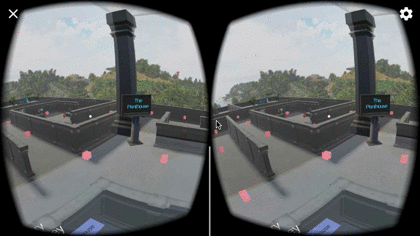
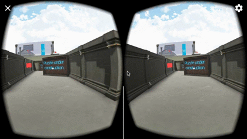
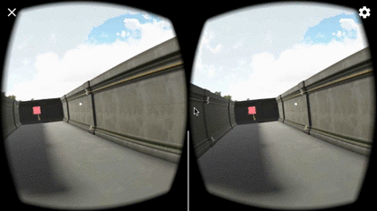
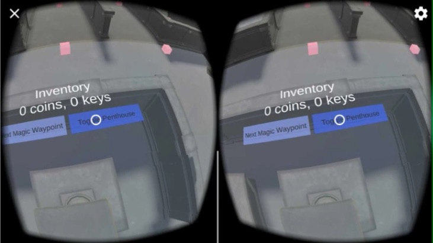

# Walkthrough Descriptions - udnd_03_maze
udnd Maze for project 3 in Udacity VR course - September 2017

Read no further unless you want to see solutions for the "maze" in this game!

This maze combines collectables (coins and keys) with a simple locked door (the temple)
to encourage the player to navigate the space and find objects.

Originally, discovering the key to the door was going to require *solving* three
puzzles, but for simpler gameplay, the key is now always present and really the only
required collectable for the user.

1. In the back right of the maze, one coin can be found by spelling out the word
"Bananas" next to the trees and bananas on the ground.
   * A sign indicates that "spell out the obvious"
   * In this area, the user must gaze at the right letter in order.
   * 
1. In the central-right part of the maze, one coin can be found by releasing
the blue colored balloons.
   * A sign indicates that "free those that make you blue"
   * Here, the user releases one of many balloons by clicking on them.
   * 
1. In the central-left part of the maze, a video-based playback and quiz were planned,
but not implemented due to time and complexity.  Here, one coin can be found by watching a
fish video and answering questions.
   * A sign indicates "a sharp eye is often paid quite well"
   * 
1. The key is adjacent to the balloon puzzle and is currently always present.
   * 
1. A view of the temple roof from the "penthouse" will let a player get a quick
   cheat sheet if they look
   * 

## Inventory and Jumping to Critical Sections
As a shortcut to navigation through the maze, the player may discover the "inventory"
panel by looking down towards the back of the maze.  On this panel, the current
count of coins and keys is available in addition to two buttons that allow the user
to either (a) iterate through a short list of "magic" waypoints (the puzzles and the
front of the temple) or (b) teleport back and forth from the "penthouse", a room
which provides an overview of the maze in a simulated glass skybox (see the overview above).

## The Final Puzzle
The final (but unimplemented) puzzle was to be a quick Q&A about a [relaxing
fish video from youtube](https://www.youtube.com/watch?v=bdnHKdb-Oss). There
was a little effort spent in planning of this puzzle, so for that reason, it's
included in the repo below.  

**Note: As with other assets in this program,  there is no implication of
license transfer for this content.  It remains under the purview and restrictions
from the original author.**

(the questions)

1. Q: What color was the first fish in the video? A: Orange, B: Blue, C: Yellow
1. Q: How many jellyfish were in the second video? A: hundreds, B: three, C: four
1. Q: What type of fish was in the last video? A: Clownfish, B: Mantaray, C: Dolphin

