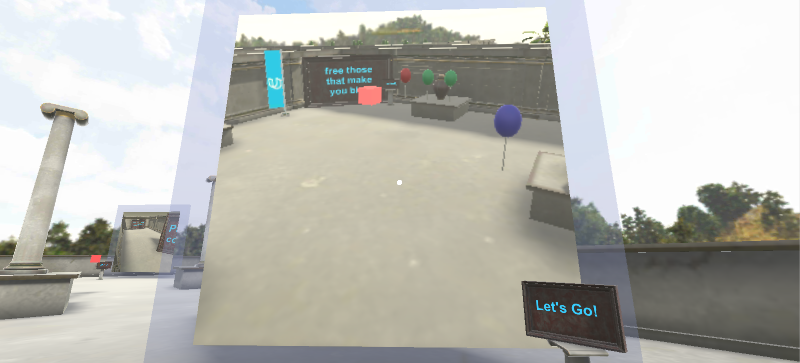
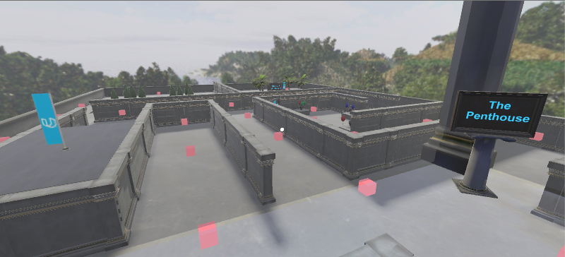

(Posted as information for a nomination -- thanks!)

## Overview
This project got a little out of hand, but it was fun the whole time.  From the onset, two goals were to 
   a. make it a fun maze experience for myself and my users (my family) and 
   b. get some hands-on experience with a lot of the interesting functions that Unity offered.  

During design, these goals included (a) object and physics interactions for balloons, (b) render textures for "in game cameras", (c) truly moving a user in 3D (up/down) to explore a complex space.  

Having the starter materials (a working area and the wall textures) helped to limit the work effort required to design the maze (mostly copy-paste operations) but still left a lot of flexibility for the content.  Although navigation through so many waypoints in the space was a little bit of an issue, most testers were distracted enough by the game to not complain.  The game could also have evolved more into a "quest" where keys are sought out one at a time, but users didn’t exhibit a consistent order or exploration pattern to worry about that additional game mechanic requirement.

## Spelling Game

This image depicts one of three games to get the "keys" for the within the game - the spelling game.  Combining some visual and textual cues, the user was required to spell out "bananas" to trigger the appearance of a key.  An interesting finding here is how hard it is to perform traditional tasks like text entry when using only the reticle (center pointer) as the main interaction object.  Visual and audio cues helped to get users to understand what was happening (in any of the puzzles) more easily.

## Render Texture

This image captures two fun parts fo the game that were also learning experiences: the use of an in-game render texture and some pseudo-physics with floating balloons.  The texture was a fun way to show a live view of another part of the maze, that users could consequently transport themselves to, similar to video cameras in more FPS style interactions.  The balloons were a way to make something interactive that fit the game’s mini-game setting but was also a bit of puzzle — what do you do with the balloons and how do they interact together?

## Render Texture

This video is a final walkthrough of the game with just one of many potential paths for the user to experience the maze.  While originally creating the experience, users first had to get all coins (3 coins, one from each mini game) before the key would present itself, but that drew out the gameplay too much.  So instead, the key is floating somewhere in the maze and can simply be acquired by discovering its location.  To give users a hint, a cheat sheet was created just above the main treasure room (temple), but most users didn’t pick up on its hints and instead spent time exploring the maze at large.  The use of a glass structure was a nice experimental side effort that allowed a true overview of the entire experience.

